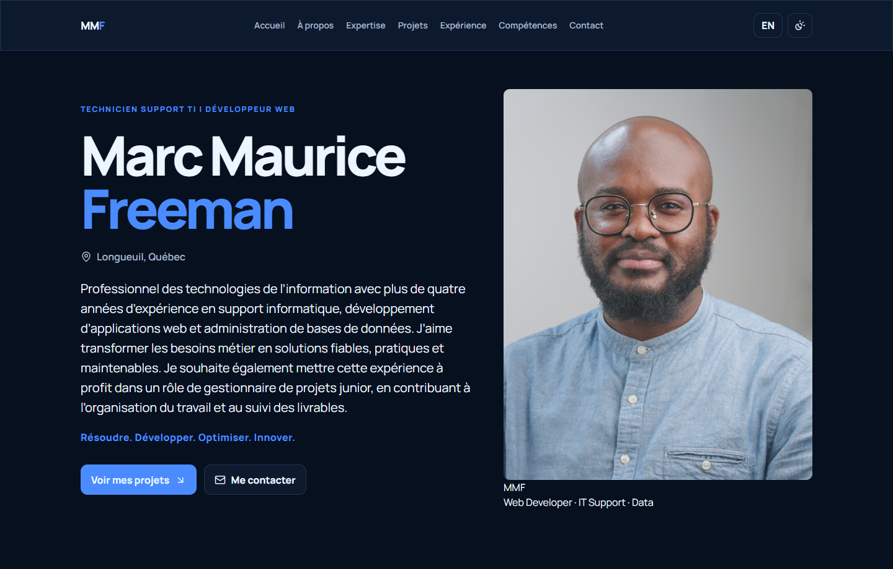
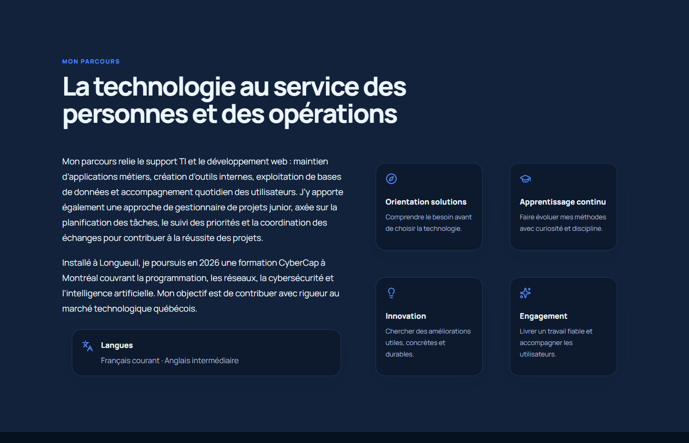
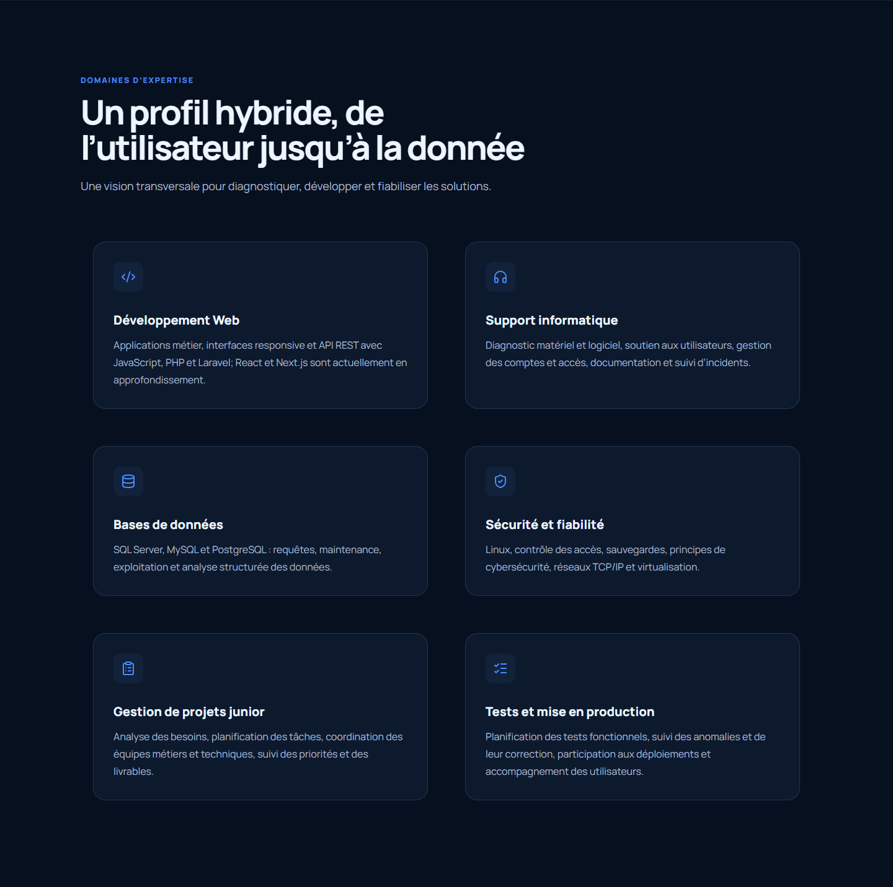
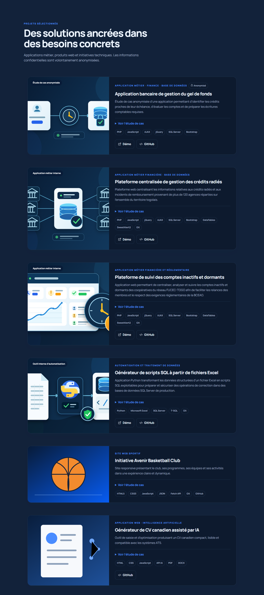
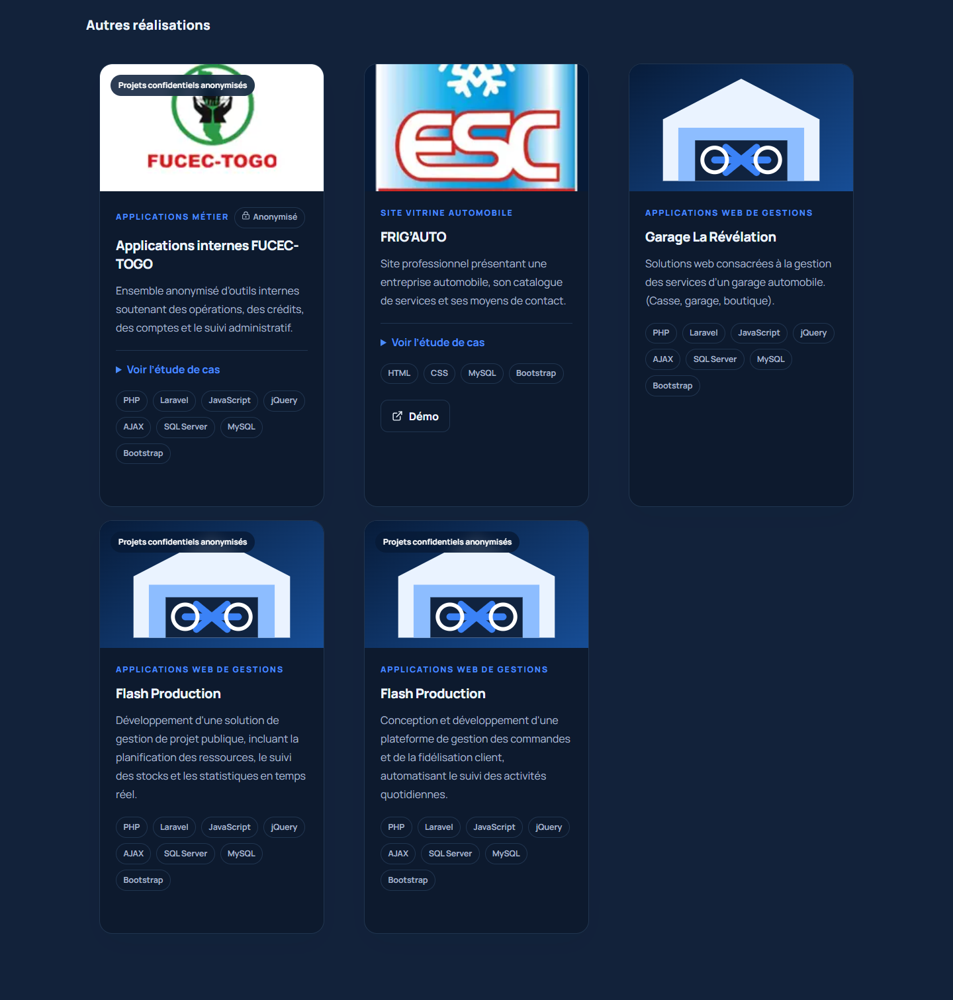
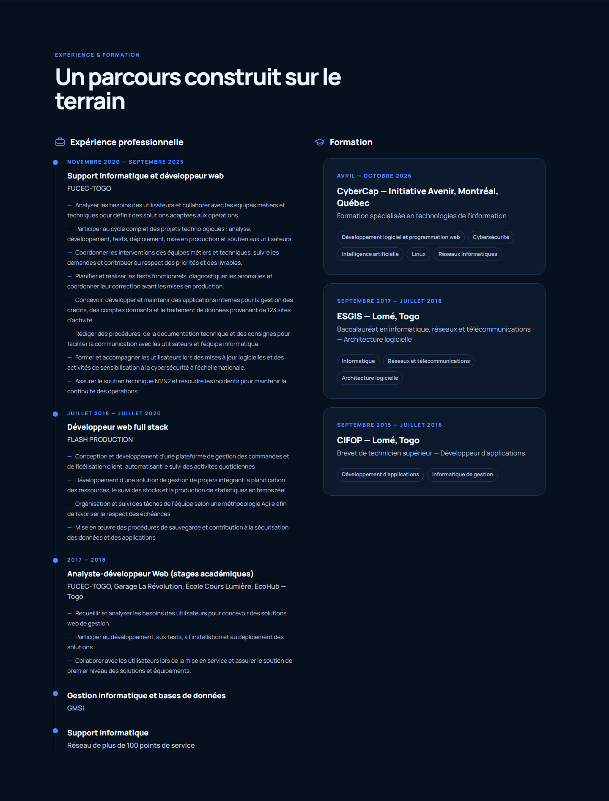
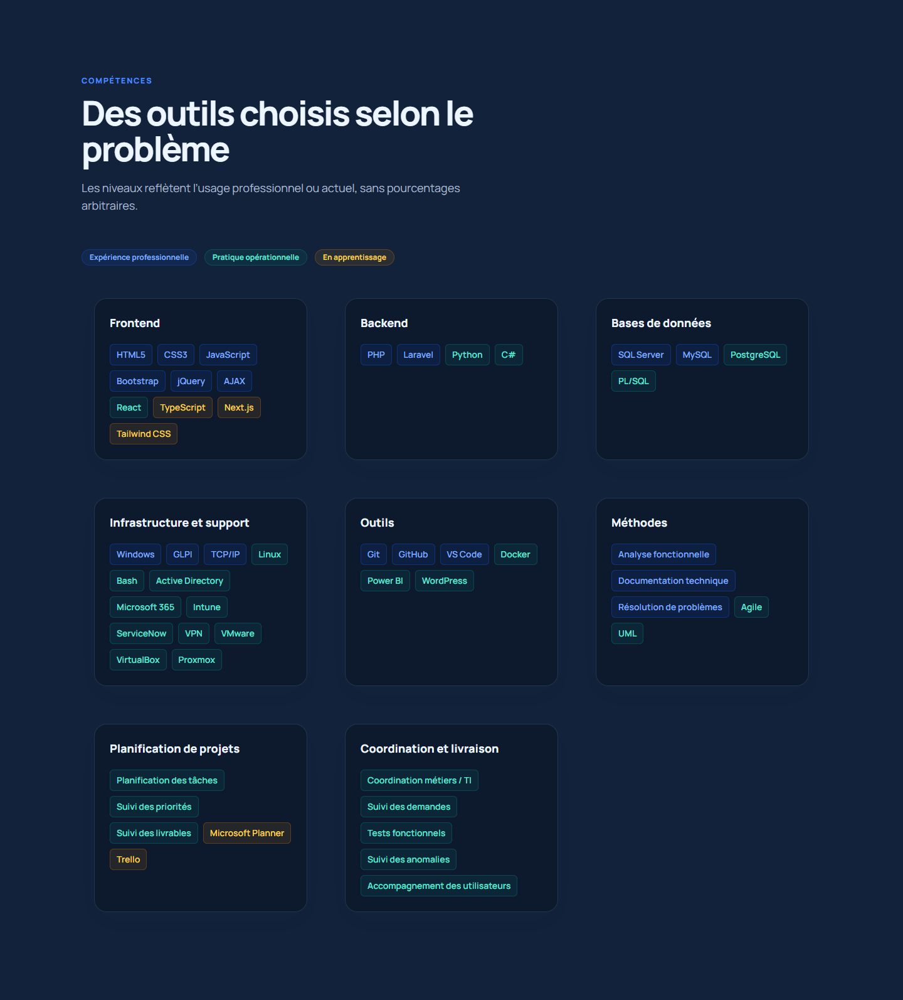
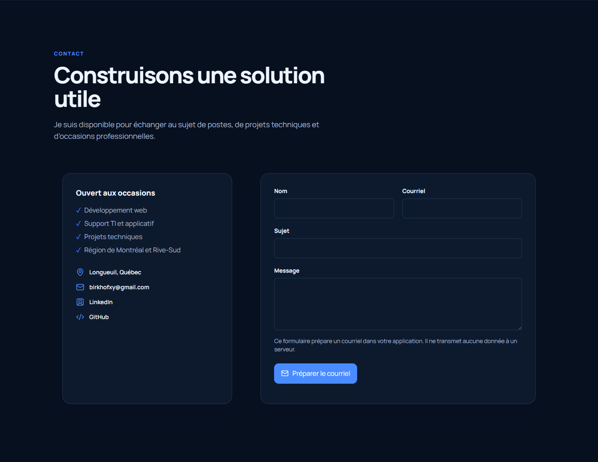

# Portfolio professionnel — Marc Maurice Freeman

Portfolio bilingue (français/anglais) destiné aux recruteurs du Québec et du Canada. Il présente un profil hybride en support TI, développement web, bases de données, cybersécurité, analyse fonctionnelle et gestion de projets junior.

## Aperçu

> Le portfolio est actuellement disponible en environnement local et sera prochainement mis en ligne.

L’interface propose une navigation bilingue, un thème sombre soigné et une présentation structurée du parcours, des projets et des compétences.

[](public/images/screenshots/1.png)

Captures de la version française en thème sombre, actualisées le 9 septembre 2026. Elles présentent notamment les tâches de développement et de coordination de projets, ainsi que les compétences Microsoft Planner et Trello.

### Profil et domaines d’expertise

<p>
  <a href="public/images/screenshots/2.png"></a>
  <a href="public/images/screenshots/3.png"></a>
</p>

### Projets sélectionnés

<p>
  <a href="public/images/screenshots/4.png"></a>
  <a href="public/images/screenshots/5.png"></a>
</p>

### Expérience et compétences

<p>
  <a href="public/images/screenshots/6.png"></a>
  <a href="public/images/screenshots/7.png"></a>
</p>

### Contact

[](public/images/screenshots/8.png)

## Technologies

- Next.js 16 avec App Router et React 19
- TypeScript en mode strict
- Tailwind CSS 4
- Framer Motion et Lucide React
- Vitest et Testing Library
- ESLint avec les règles Next.js Core Web Vitals

## Installation

Prérequis : une version LTS récente de Node.js et npm.

```bash
npm install
npm run dev
```

Ouvrez ensuite `http://localhost:3000`. La racine redirige vers la version française; la version anglaise est accessible à `/en`.

## Commandes

```bash
npm run dev        # serveur de développement
npm run typecheck  # vérification TypeScript
npm run lint       # analyse ESLint
npm test           # tests automatisés
npm run build      # compilation de production
npm start          # serveur de production
```

## Personnalisation

- Coordonnées, CV et URL principales : `src/data/site.ts`
- Projets et liens de démonstration : `src/data/projects.ts`
- Expériences, valeurs et formations : `src/data/profile.ts`
- Compétences et niveaux : `src/data/skills.ts`
- Textes de sections : `src/components/sections`

### Ajouter le CV

Déposez le PDF dans `public/documents`, puis remplacez `URL_CV_A_REMPLACER` par un chemin comme `/documents/marc-maurice-freeman-cv.pdf`.

### Ajouter ou remplacer les images

Déposez les fichiers optimisés dans `public/images`, puis modifiez la propriété `image` du projet concerné. Les SVG actuels sont des illustrations temporaires locales et légères.

### Configurer les liens

- Url GitHub : https://github.com/shadownet21/
- Url LinkedIn : www.linkedin.com/in/marc-maurice-freeman-324816394

Les liens et champs temporaires sont masqués dans l’interface publique. Le formulaire de contact apparaît après configuration du courriel; il utilise `mailto:` et ne promet aucun envoi serveur.

## Déploiement sur Vercel

1. Importez le dépôt dans Vercel.
2. Conservez le preset Next.js et les commandes détectées automatiquement.
3. Définissez `NEXT_PUBLIC_SITE_URL` avec le domaine public final. Sur Vercel, le projet peut aussi utiliser automatiquement `VERCEL_PROJECT_PRODUCTION_URL`.
4. Déployez, puis contrôlez les métadonnées et les liens avec le domaine final.

Le projet ne requiert ni base de données ni secret pour cette première version. Les fichiers `.env*` sont ignorés, sauf `.env.example`.
