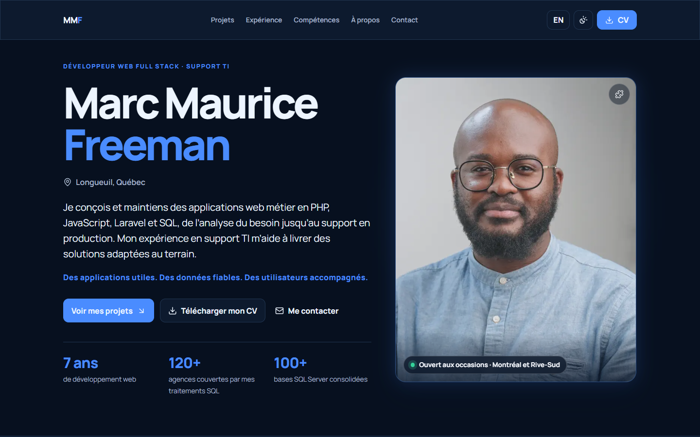
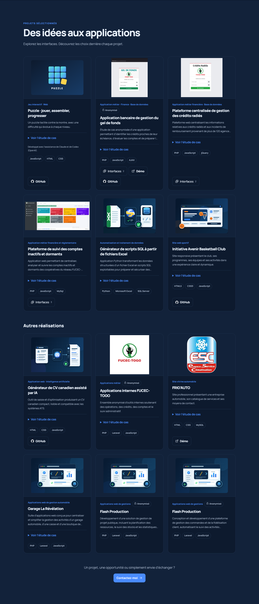
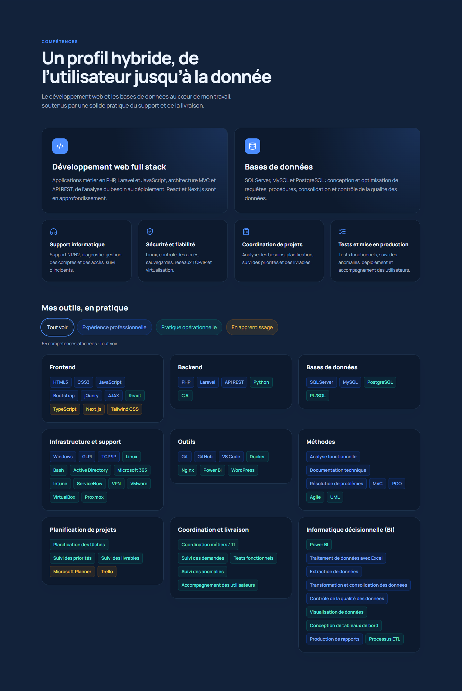
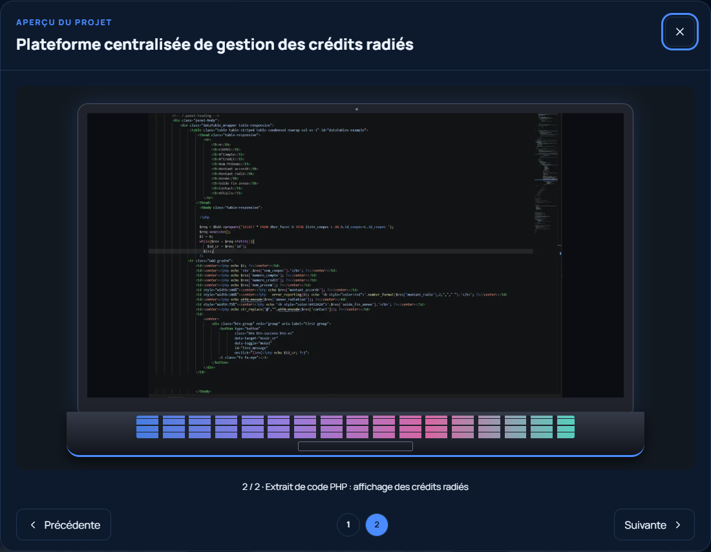
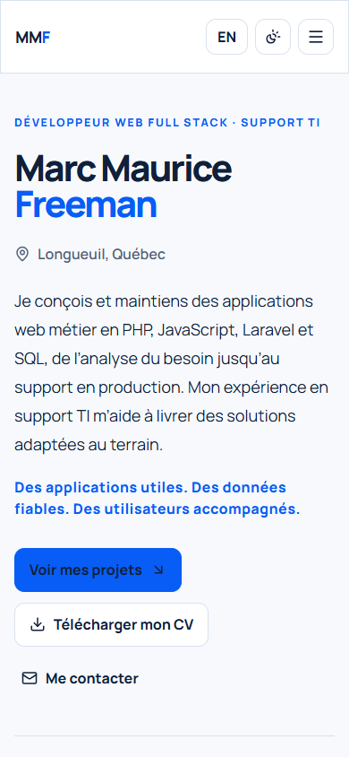

# Portfolio professionnel — Marc Maurice Freeman

Portfolio bilingue français/anglais consacré au développement web, au support TI, aux données et à la coordination de projets. Interface responsive, thèmes clair et sombre et études de cas consultables à la demande.

## Aperçu

Captures de la version locale compilée, actualisées le **11 septembre 2026**.

[](public/images/screenshots/redesign-home.png)

<details>
<summary>Projets et compétences</summary>

[](public/images/screenshots/redesign-projects.png)

[](public/images/screenshots/redesign-skills.png)

</details>

### Galerie des applications

[](public/images/screenshots/gallery-laptop.png)

<details>
<summary>Aperçu mobile</summary>



</details>

## Expérience utilisateur

- Portrait initialement invisible, puis recomposé en vingt pièces de puzzle en environ deux secondes : une animation par chargement, déclenchée après la fin réelle des six animations du texte et lorsque la photo devient visible, avec image statique si les mouvements sont réduits.
- Logos officiels GitHub et LinkedIn, conservés localement.
- Navigation avec section active, progression du défilement et transitions respectant la préférence de réduction des mouvements.
- Deux grilles de six projets, résumés compacts et détails accessibles par « Voir l’étude de cas ».
- Filtres de compétences : expérience professionnelle, pratique opérationnelle et apprentissage. « Tout voir » restaure les neuf catégories, dont l’informatique décisionnelle.
- Aperçus réels de Gel, Crédits radiés et ECI. Galeries avec boutons, sélection directe, flèches du clavier, fermeture par Échap et restitution du focus.
- Capture de code PHP des crédits radiés intégrée dans un laptop gamer responsive construit en CSS.

## Projet puzzle

Le [jeu de puzzle](https://github.com/shadownet21/jeupuzzle) dispose d’une carte et d’une étude de cas bilingues : trois images, niveaux progressifs, glisser-déposer souris/tactile, aimantation, chronomètre, pause, indices et confettis.

La description repose sur le [README.txt de la version publique](https://github.com/shadownet21/jeupuzzle/blob/main/README.txt), consulté le 11 septembre 2026. Le développement assisté par Claude et Codex (OpenAI) est mentionné discrètement. Le lien de démonstration reste masqué tant qu’une URL publique de jeu n’est pas configurée.

Le site FRIG’AUTO utilise [https://frigauto.com](https://frigauto.com).

## Installation et lancement

Prérequis : Node.js compatible avec les versions du projet et npm.

```bash
npm ci
npm run dev
```

Ouvrir `http://localhost:3000/fr` ou `http://localhost:3000/en`.

Pour servir la dernière version en production, **recompiler avant de lancer le serveur** :

```bash
npm run build
npm start
```

`npm start` sert les fichiers déjà compilés dans `.next` ; il ne recompile pas les modifications du code.

## Vérifications

```bash
npm run lint
npm test
npm run build
npm run typecheck
```

Contrôle du 11 septembre 2026 : ESLint sans avertissement, huit tests réussis, compilation et TypeScript réussis. Parcours Chromium vérifié à 1440 × 1000 et 390 × 844 : français/anglais, thèmes, filtres, galeries, clavier, réduction des mouvements et absence d’erreurs JavaScript ou de ressources HTTP.

Le détail des dix demandes et de leur vérification figure dans le [compte rendu UI/UX](docs/UI-REVIEW.md).

## Technologies et personnalisation

Next.js 16, React 19, TypeScript, Tailwind CSS 4, Framer Motion, Lucide React, Resend, Vitest et Testing Library.

| Contenu | Fichier |
|---|---|
| Coordonnées, liens et CV | `src/data/site.ts` |
| Projets, couvertures et galeries | `src/data/projects.ts` |
| Compétences et niveaux | `src/data/skills.ts` |
| Expériences et formations | `src/data/profile.ts` |
| Galerie et navigation clavier | `src/components/ui/project-gallery.tsx` |
| Styles et laptop | `src/app/globals.css` |

Pour une galerie, renseigner `gallery` avec un chemin local `src` et une légende `caption` en français et en anglais. `presentation: "laptop"` active l’encadrement du code. Déposer les captures sélectionnées dans `public/images`.

Les captures de connexion servent de couverture lorsqu’elles existent. ECI utilise son tableau de bord, car les images fournies ne contiennent pas d’écran de connexion. Les captures non sélectionnées ne sont pas ajoutées au dépôt par cette mise à jour.

### Formulaire de contact

Le formulaire appelle `/api/contact`, qui utilise Resend. Configurer côté serveur :

- `RESEND_API_KEY`
- `CONTACT_EMAIL`
- `CONTACT_FROM_EMAIL`

Les secrets restent dans l’environnement, jamais dans Git. Aucun courriel n’a été envoyé pendant les contrôles de cette mise à jour.

### Déploiement

Importer le dépôt sur Vercel avec le preset Next.js. Configurer les variables du formulaire et `NEXT_PUBLIC_SITE_URL` avec le domaine final ; le projet peut aussi utiliser `VERCEL_PROJECT_PRODUCTION_URL`. Lancer la compilation puis vérifier les liens et métadonnées du site déployé.

### Origine des logos

Assets téléchargés depuis les [ressources officielles GitHub](https://brand.github.com/foundations/logo) et [LinkedIn](https://brand.linkedin.com/downloads). Les logos sont la propriété de leurs marques respectives.
