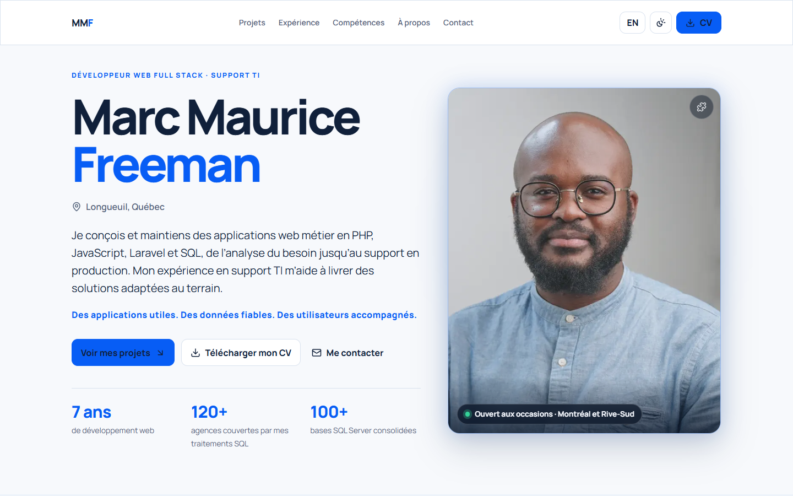
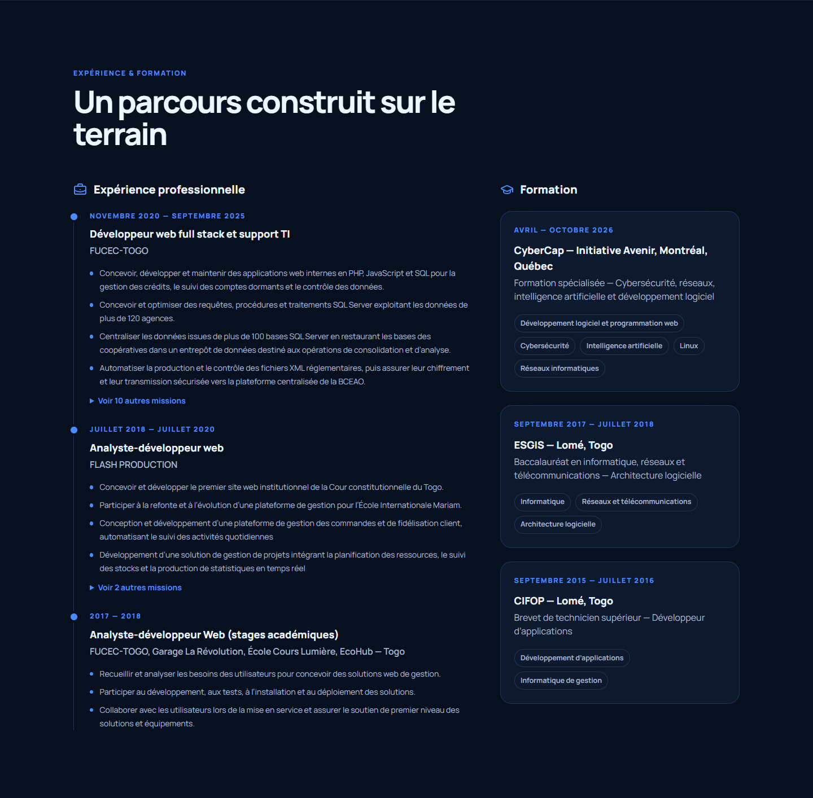
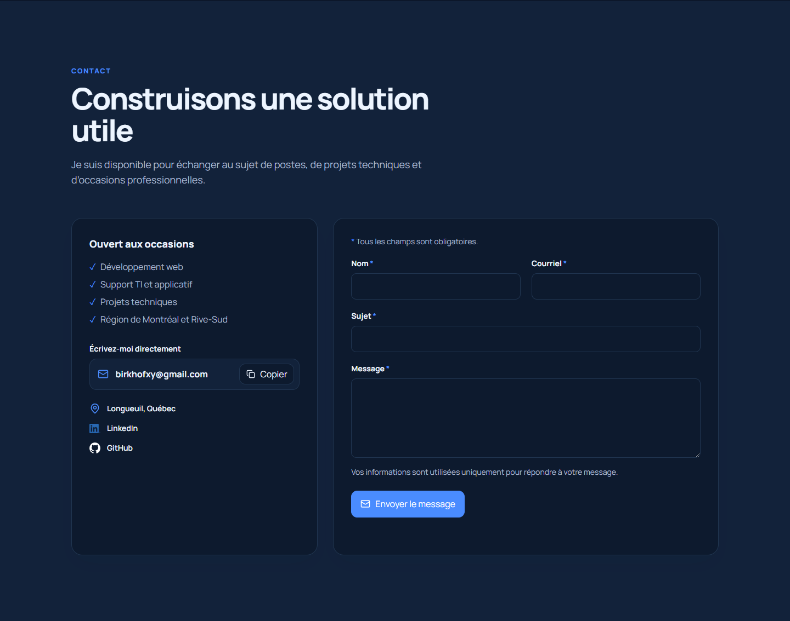
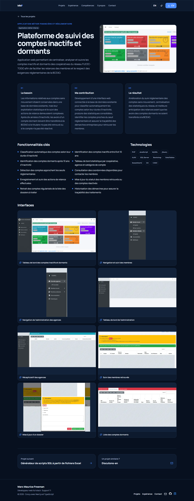
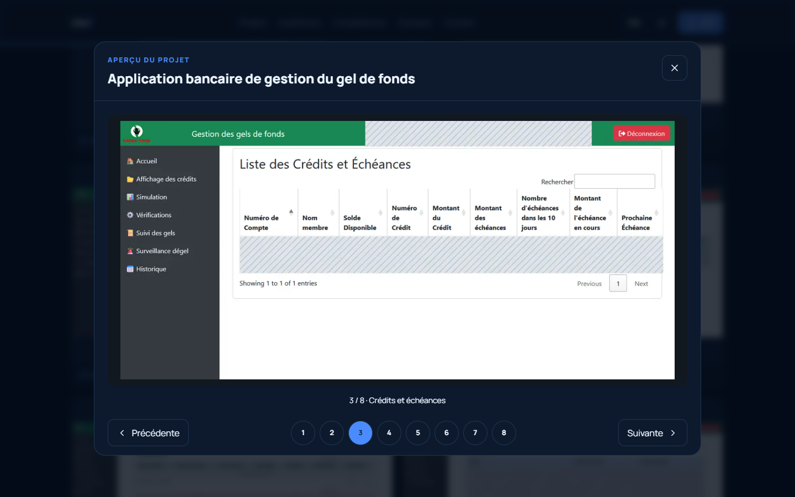
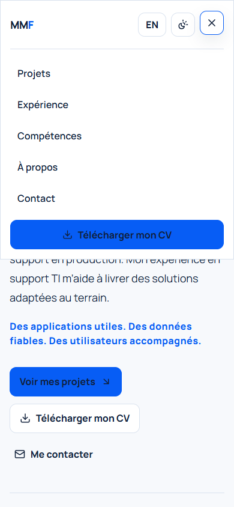

# Portfolio professionnel — Marc Maurice Freeman

Portfolio bilingue français/anglais d’un développeur web full stack (PHP, JavaScript, Laravel, SQL) avec une expérience en support TI. Interface responsive, thèmes clair et sombre, CV téléchargeable et une page d’étude de cas par projet.

## Aperçu

Captures de la version de production compilée, actualisées le **25 septembre 2026**.

[](public/images/screenshots/redesign-home.png)

<details>
<summary>Thème clair</summary>

[](public/images/screenshots/redesign-home-light.png)

</details>

<details>
<summary>Projets, expérience, compétences et contact</summary>

[](public/images/screenshots/redesign-projects.png)

[](public/images/screenshots/redesign-experience.png)

[](public/images/screenshots/redesign-skills.png)

[](public/images/screenshots/redesign-contact.png)

</details>

### Études de cas

[](public/images/screenshots/redesign-case-study.png)

<details>
<summary>Visionneuse des interfaces</summary>

[](public/images/screenshots/redesign-gallery.png)

</details>

<details>
<summary>Aperçu mobile</summary>

 

</details>

## Expérience utilisateur

L’accueil présente le développement web full stack et le soutien TI. La signature résume l’approche : « Des applications utiles. Des données fiables. Des utilisateurs accompagnés. » / « Useful applications. Reliable data. Supported users. ».

- **Accueil sans attente :** le titre, le texte et la photo s’affichent dès le premier rendu, sans animation d’entrée. Le puzzle du portrait est facultatif : un bouton sur la photo recompose le portrait en vingt pièces en environ une seconde. Le bouton est masqué si les mouvements sont réduits.
- **Chiffres clés alignés sur le CV :** 7 ans de développement web, plus de 120 agences couvertes par les traitements SQL, plus de 100 bases SQL Server consolidées.
- **CV** téléchargeable depuis l’en-tête, l’accueil et le menu mobile.
- **Navigation en cinq entrées** (Projets, Expérience, Compétences, À propos, Contact), avec section active et barre de progression du défilement.
- **Projets :** toute la carte est cliquable et ouvre `/fr/projets/<slug>` ou `/en/projets/<slug>`. Chaque page présente le besoin, la contribution, le résultat, les fonctionnalités, les technologies, les interfaces et le projet suivant. Les liens de démonstration et GitHub restent masqués tant qu’aucune URL publique n’est configurée.
- **Expérience :** les quatre missions principales de chaque poste sont visibles, les suivantes se déplient.
- **Compétences :** six domaines d’expertise en grille, puis un filtre par niveau (expérience professionnelle, pratique opérationnelle, apprentissage).
- **Contact :** courriel direct avec bouton « Copier », formulaire avec champs obligatoires signalés, erreurs affichées sous chaque champ après une tentative d’envoi, et confirmation dans la page.
- **Galeries :** miniatures, visionneuse avec sélection directe, flèches du clavier, fermeture par Échap et retour du focus sur la miniature.
- **Accessibilité et normes :** `lang` correct côté serveur (`fr-CA` ou `en-CA`), lien d’évitement, animations courtes et sans flou, respect de `prefers-reduced-motion`. Seuls les éléments cliquables réagissent au survol.
- Captures des applications métier anonymisées dans les fichiers publics avant affichage.

## Projet puzzle

Le [jeu de puzzle](https://github.com/shadownet21/jeupuzzle) dispose d’une étude de cas bilingue : trois images, niveaux progressifs, glisser-déposer souris/tactile, aimantation, chronomètre, pause, indices et confettis. Le développement assisté par Claude et Codex (OpenAI) y est mentionné.

Le site FRIG’AUTO utilise [https://frigauto.com](https://frigauto.com).

## Installation et lancement

Prérequis : Node.js compatible avec les versions du projet et npm.

```bash
npm ci
npm run dev
```

Ouvrir `http://localhost:3000/fr` ou `http://localhost:3000/en`. L’adresse `/` redirige vers `/fr`.

Pour servir la dernière version en production, **recompiler avant de lancer le serveur** :

```bash
npm run build
npm start
```

`npm start` sert les fichiers déjà compilés dans `.next` ; il ne recompile pas les modifications du code. Arrêter tout serveur `npm start` en cours avant de recompiler.

## Vérifications

```bash
npm run lint
npm run typecheck
npm test
npm run build
```

Contrôle du 25 septembre 2026 :
- ESLint, TypeScript et compilation réussis ; 22 tests réussis ; 29 pages statiques générées, dont 20 études de cas.
- Parcours Chrome à 390 et 1440 px en thèmes clair et sombre : pas de débordement horizontal, pas d’erreur de console. Menu mobile, puzzle, formulaire, copie du courriel et visionneuse vérifiés.
- `/en` servi avec `lang="en-CA"`, `/` redirigé vers `/fr`, URL inconnues en 404, CV servi en `application/pdf`.

L’historique des demandes précédentes figure dans le [compte rendu UI/UX](docs/UI-REVIEW.md).

## Technologies et personnalisation

Next.js 16, React 19, TypeScript, Tailwind CSS 4, Framer Motion, Lucide React, Vitest et Testing Library.

| Contenu | Fichier |
|---|---|
| Rôle, courriel, liens et chemin du CV | `src/data/site.ts` |
| CV publié | `public/documents/marc-maurice-freeman-cv.pdf` |
| Projets, couvertures et galeries | `src/data/projects.ts` |
| Domaines d’expertise, compétences et niveaux | `src/data/skills.ts` |
| Expériences, formations et références | `src/data/profile.ts` |
| Page d’étude de cas | `src/app/[locale]/projets/[slug]/page.tsx` |
| Layout racine, langue et thème | `src/app/[locale]/layout.tsx` |
| Galerie et navigation clavier | `src/components/ui/project-gallery.tsx` |
| Styles de l’interface | `src/app/globals.css` |

Pour mettre à jour le CV, remplacer `public/documents/marc-maurice-freeman-cv.pdf` en gardant le même nom. Un test vérifie que le fichier existe.

Pour une galerie, renseigner `gallery` avec un chemin local `src` et une légende `caption` en français et en anglais. Déposer uniquement des captures vérifiées et anonymisées dans `public/images`.

La couverture d’un projet montre l’écran le plus représentatif (tableau de bord ou écran principal) plutôt que l’écran de connexion. Les captures sont recadrées par le haut. Pour un logo, indiquer `coverFit: "contain"`. Le script `scripts/anonymize-screenshots.ps1` décrit les zones masquées des captures métier.

### Formulaire de contact

Le formulaire appelle `POST /api/contact`, qui enregistre les messages dans `data/contact-messages.json` à la racine du projet. Le dossier et le fichier sont créés au premier message valide. Aucun courriel n’est envoyé et aucune clé Resend n’est nécessaire. Les visiteurs peuvent aussi écrire directement à l’adresse affichée dans la section Contact.

Le fichier contient un tableau JSON : chaque entrée comprend `id`, `receivedAt` (date UTC), `name`, `email`, `subject` et `message`. Consulter ce fichier directement sur le serveur pour lire les demandes. Il reste hors de `public`, est exclu de Git et doit être sauvegardé avec les données du serveur.

La validation (côté client et côté serveur), le champ anti-spam et la limitation des tentatives restent actifs. Les écritures sont sérialisées dans le processus Node.js et remplacent le fichier de façon atomique. Si le fichier est illisible ou si l’écriture échoue, le formulaire signale une erreur, n’annonce pas de réception et n’écrase pas les données existantes.

### Déploiement

Utiliser un serveur Node.js unique avec un disque persistant et un accès en écriture au dossier `data`. Lancer `npm run build`, puis `npm start`. Sauvegarder et conserver `data` lors des mises à jour. Ce stockage local ne convient pas aux instances multiples ni à un hébergement sans disque persistant ; utiliser alors une base de données ou un stockage externe.

Configurer `NEXT_PUBLIC_SITE_URL` avec le domaine final. Sans URL de production, les liens canoniques, les versions linguistiques et les entrées du sitemap ne sont pas générés. Vérifier les liens et métadonnées du site déployé.

### Origine des logos

Assets téléchargés depuis les [ressources officielles GitHub](https://brand.github.com/foundations/logo) et [LinkedIn](https://brand.linkedin.com/downloads). Les logos sont la propriété de leurs marques respectives.
